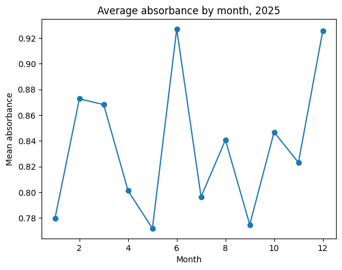
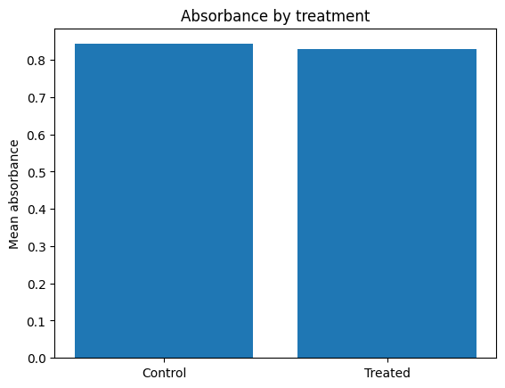

# Session 1 — Make the Computer Do Your Boring Work

Twelve months of lab results, twelve messy files. By hand in Excel this is an afternoon. We are going to do it in a few lines, live, together.

**By the end of this session you can:**

- Open a data file in Python and see what is inside it
- Combine many files into one table without copy-paste
- Clean the three messes that show up in almost every real dataset
- Summarise a whole year with one line, and draw a plot you could put in a paper
- Read an error message instead of fearing it

You will not write programs from scratch today. The goal is to *read, run, and safely change* code — the skills you actually need on Monday.

## Setup (Google Colab only)

The cell below installs the two tools we use. **Run it first, before we start.** If Colab shows a *Restart* button after it finishes, click it — that is normal and only happens once. If you are not on Colab you can skip this cell.


```python
# Colab only. Run this first, before we start.
!pip install -q pandas==2.2.2 matplotlib==3.9.2
print("Libraries ready.")
```

## Load the tools

An **import** loads a toolbox someone else wrote. `pandas` is a spreadsheet that lives in Python; we nickname it `pd`. `matplotlib` draws charts; we nickname its drawing part `plt`. A **variable** is just a name we give to a value so we can reuse it — here `DATA_BASE_URL` holds the web address our data lives at, written once so we never retype it.


```python
import pandas as pd
import matplotlib.pyplot as plt
%matplotlib inline

DATA_BASE_URL = "https://raw.githubusercontent.com/sanzidikawsar/python-crash-course/main/data/session1"

print("pandas version:", pd.__version__)
```

    pandas version: 2.3.3


## The 30-minute Excel job, in six lines

We have twelve files, one per month, named `results_2025_01.csv` up to `results_2025_12.csv`. In Excel you would open each, copy, paste, and pray. Watch what happens instead. Do not worry about understanding every word yet — we take it apart right after.


```python
all_months = []
for month in range(1, 13):
    file_url = f"{DATA_BASE_URL}/results_2025_{month:02d}.csv"
    all_months.append(pd.read_csv(file_url))

year = pd.concat(all_months, ignore_index=True)
print("Loaded", year.shape[0], "rows from 12 files")
```

    Loaded 972 rows from 12 files


Here are the first rows of the whole year in one glance:


```python
year.head()
```


<div>
<style scoped>
    .dataframe tbody tr th:only-of-type {
        vertical-align: middle;
    }

    .dataframe tbody tr th {
        vertical-align: top;
    }

    .dataframe thead th {
        text-align: right;
    }
</style>
<table border="1" class="dataframe">
  <thead>
    <tr style="text-align: right;">
      <th></th>
      <th>sample_id</th>
      <th>treatment</th>
      <th>replicate</th>
      <th>absorbance</th>
      <th>ph</th>
      <th>date</th>
      <th>Unnamed: 6</th>
    </tr>
  </thead>
  <tbody>
    <tr>
      <th>0</th>
      <td>S01001</td>
      <td>Treated</td>
      <td>2.0</td>
      <td>1.044</td>
      <td>7.88</td>
      <td>2025-01-01</td>
      <td>NaN</td>
    </tr>
    <tr>
      <th>1</th>
      <td>S01002</td>
      <td>Control</td>
      <td>2.0</td>
      <td>0.345</td>
      <td>7.46</td>
      <td>2025-01-28</td>
      <td>NaN</td>
    </tr>
    <tr>
      <th>2</th>
      <td>S01003</td>
      <td>TREATED</td>
      <td>2.0</td>
      <td>0.457</td>
      <td>7.48</td>
      <td>2025-01-18</td>
      <td>NaN</td>
    </tr>
    <tr>
      <th>3</th>
      <td>S01004</td>
      <td>Control</td>
      <td>2.0</td>
      <td>1.121</td>
      <td>7.50</td>
      <td>2025-01-18</td>
      <td>NaN</td>
    </tr>
    <tr>
      <th>4</th>
      <td>S01005</td>
      <td>control</td>
      <td>3.0</td>
      <td>0.203</td>
      <td>7.18</td>
      <td>2025-01-16</td>
      <td>NaN</td>
    </tr>
  </tbody>
</table>
</div>


Now count how many rows belong to each treatment. Look closely at the result — something is already wrong, and spotting it is your first real data-cleaning instinct.


```python
year["treatment"].value_counts()
```


    treatment
    Treated     371
    Control     349
    treated      47
    control      43
    TREATED      42
    Control      40
    CONTROL      39
    treated      29
    Name: count, dtype: int64


`Control`, `control`, and `CONTROL` are counted as three different things, even though they mean the same treatment. That is the kind of silent mess we will learn to fix. First, let's slow all the way down and understand what we just did.

## How a notebook works

A notebook is a stack of **cells**. A cell holds either text (like this one) or code. You run a code cell with **Shift + Enter**. The `[ ]` on the left becomes a number showing the order things ran in. Cells share memory: a variable made in one cell is available in the next. Run order matters — if you skip around, Python only knows what it has actually run.


```python
sample_count = 81
print("rows in one file:", sample_count)
```

    rows in one file: 81


Values come in types. A **number** you can do maths with; a **string** is text, written inside quotes. The `f"..."` below is an *f-string* — Python swaps anything in `{ }` for its value, so we can mix text and variables in one printed line.


```python
treatment_name = "Control"
print(f"the treatment is {treatment_name}")
```

    the treatment is Control


Code can make a decision with **`if`**: the indented line runs only when the condition is true. A pH above 7.5 is slightly basic, so:


```python
newest_ph = 7.6
if newest_ph > 7.5:
    print("this sample is slightly basic")
```

    this sample is slightly basic


A **list** is an ordered collection, written in square brackets. You reach an item by its position, and Python counts from **0**, so the first item is `[0]`. `len(...)` tells you how many items there are.


```python
months = [1, 2, 3, 4, 5, 6]
print("first month:", months[0])
print("how many:", len(months))
```

    first month: 1
    how many: 6


### Break it on purpose

We are going to cause an error on purpose. Errors are not scars — they are the computer telling you exactly what it could not do. The single most useful habit today is to **read the last line first**. Here we ask for a variable name that does not exist:


```python
print(monthss)
```


    ---------------------------------------------------------------------------

    NameError                                 Traceback (most recent call last)

    Cell In[9], line 1
    ----> 1 print(monthss)


    NameError: name 'monthss' is not defined


Read the traceback from the **bottom up**. The last line says `NameError: name 'monthss' is not defined`. `NameError` means *I have never heard of that name*. We simply misspelled `months`. The fix:


```python
print(months)
```

    [1, 2, 3, 4, 5, 6]


## Getting data in

This block is roughly 80% of everything you will ever do with data. We load **one** file first, so we can look at it slowly. `pd.read_csv(...)` reads a CSV file into a **DataFrame** — think of it as one sheet of a spreadsheet that Python can work on.


```python
jan = pd.read_csv(f"{DATA_BASE_URL}/results_2025_01.csv")
jan.head()
```


<div>
<style scoped>
    .dataframe tbody tr th:only-of-type {
        vertical-align: middle;
    }

    .dataframe tbody tr th {
        vertical-align: top;
    }

    .dataframe thead th {
        text-align: right;
    }
</style>
<table border="1" class="dataframe">
  <thead>
    <tr style="text-align: right;">
      <th></th>
      <th>sample_id</th>
      <th>treatment</th>
      <th>replicate</th>
      <th>absorbance</th>
      <th>ph</th>
      <th>date</th>
    </tr>
  </thead>
  <tbody>
    <tr>
      <th>0</th>
      <td>S01001</td>
      <td>Treated</td>
      <td>2.0</td>
      <td>1.044</td>
      <td>7.88</td>
      <td>2025-01-01</td>
    </tr>
    <tr>
      <th>1</th>
      <td>S01002</td>
      <td>Control</td>
      <td>2.0</td>
      <td>0.345</td>
      <td>7.46</td>
      <td>2025-01-28</td>
    </tr>
    <tr>
      <th>2</th>
      <td>S01003</td>
      <td>TREATED</td>
      <td>2.0</td>
      <td>0.457</td>
      <td>7.48</td>
      <td>2025-01-18</td>
    </tr>
    <tr>
      <th>3</th>
      <td>S01004</td>
      <td>Control</td>
      <td>2.0</td>
      <td>1.121</td>
      <td>7.50</td>
      <td>2025-01-18</td>
    </tr>
    <tr>
      <th>4</th>
      <td>S01005</td>
      <td>control</td>
      <td>3.0</td>
      <td>0.203</td>
      <td>7.18</td>
      <td>2025-01-16</td>
    </tr>
  </tbody>
</table>
</div>


`.head()` shows the first five rows. Two more everyday questions: how big is the table, and what kind of value is in each column?


```python
print("rows, columns:", jan.shape)
```

    rows, columns: (81, 6)


`.dtypes` lists the type of each column. `float64` means decimal numbers, `int64` whole numbers, `object` usually means text. Watch **`absorbance`** — it is a measurement, so we expect a number, but it comes in as `object`. That is a clue that something non-numeric is hiding in it.


```python
jan.dtypes
```


    sample_id      object
    treatment      object
    replicate     float64
    absorbance     object
    ph            float64
    date           object
    dtype: object


`.describe()` gives quick statistics for the number columns — count, mean, min, max. Notice `absorbance` is **missing** from this summary: pandas will not do statistics on a column it thinks is text. We will fix that shortly.


```python
jan.describe()
```


<div>
<style scoped>
    .dataframe tbody tr th:only-of-type {
        vertical-align: middle;
    }

    .dataframe tbody tr th {
        vertical-align: top;
    }

    .dataframe thead th {
        text-align: right;
    }
</style>
<table border="1" class="dataframe">
  <thead>
    <tr style="text-align: right;">
      <th></th>
      <th>replicate</th>
      <th>ph</th>
    </tr>
  </thead>
  <tbody>
    <tr>
      <th>count</th>
      <td>80.000000</td>
      <td>80.000000</td>
    </tr>
    <tr>
      <th>mean</th>
      <td>1.875000</td>
      <td>7.164625</td>
    </tr>
    <tr>
      <th>std</th>
      <td>0.752633</td>
      <td>0.437814</td>
    </tr>
    <tr>
      <th>min</th>
      <td>1.000000</td>
      <td>6.430000</td>
    </tr>
    <tr>
      <th>25%</th>
      <td>1.000000</td>
      <td>6.730000</td>
    </tr>
    <tr>
      <th>50%</th>
      <td>2.000000</td>
      <td>7.150000</td>
    </tr>
    <tr>
      <th>75%</th>
      <td>2.000000</td>
      <td>7.540000</td>
    </tr>
    <tr>
      <th>max</th>
      <td>3.000000</td>
      <td>7.900000</td>
    </tr>
  </tbody>
</table>
</div>


To look at a single column, name it in square brackets:


```python
jan["ph"].head()
```


    0    7.88
    1    7.46
    2    7.48
    3    7.50
    4    7.18
    Name: ph, dtype: float64


For several columns, pass a **list** of names — that is why there are two sets of brackets: the outer selects, the inner is the list.


```python
jan[["sample_id", "ph"]].head()
```


<div>
<style scoped>
    .dataframe tbody tr th:only-of-type {
        vertical-align: middle;
    }

    .dataframe tbody tr th {
        vertical-align: top;
    }

    .dataframe thead th {
        text-align: right;
    }
</style>
<table border="1" class="dataframe">
  <thead>
    <tr style="text-align: right;">
      <th></th>
      <th>sample_id</th>
      <th>ph</th>
    </tr>
  </thead>
  <tbody>
    <tr>
      <th>0</th>
      <td>S01001</td>
      <td>7.88</td>
    </tr>
    <tr>
      <th>1</th>
      <td>S01002</td>
      <td>7.46</td>
    </tr>
    <tr>
      <th>2</th>
      <td>S01003</td>
      <td>7.48</td>
    </tr>
    <tr>
      <th>3</th>
      <td>S01004</td>
      <td>7.50</td>
    </tr>
    <tr>
      <th>4</th>
      <td>S01005</td>
      <td>7.18</td>
    </tr>
  </tbody>
</table>
</div>


**Filtering** keeps only the rows that match a condition. The part inside the brackets, `jan["ph"] > 7.5`, is a true/false test for every row; pandas keeps the true ones.


```python
high_ph = jan[jan["ph"] > 7.5]
print("high-pH rows:", high_ph.shape[0])
high_ph.head()
```

    high-pH rows: 21


<div>
<style scoped>
    .dataframe tbody tr th:only-of-type {
        vertical-align: middle;
    }

    .dataframe tbody tr th {
        vertical-align: top;
    }

    .dataframe thead th {
        text-align: right;
    }
</style>
<table border="1" class="dataframe">
  <thead>
    <tr style="text-align: right;">
      <th></th>
      <th>sample_id</th>
      <th>treatment</th>
      <th>replicate</th>
      <th>absorbance</th>
      <th>ph</th>
      <th>date</th>
    </tr>
  </thead>
  <tbody>
    <tr>
      <th>0</th>
      <td>S01001</td>
      <td>Treated</td>
      <td>2.0</td>
      <td>1.044</td>
      <td>7.88</td>
      <td>2025-01-01</td>
    </tr>
    <tr>
      <th>6</th>
      <td>S01007</td>
      <td>Treated</td>
      <td>3.0</td>
      <td>0.732</td>
      <td>7.72</td>
      <td>2025-01-10</td>
    </tr>
    <tr>
      <th>7</th>
      <td>S01008</td>
      <td>Treated</td>
      <td>3.0</td>
      <td>1.02</td>
      <td>7.72</td>
      <td>2025-01-24</td>
    </tr>
    <tr>
      <th>9</th>
      <td>S01010</td>
      <td>Control</td>
      <td>1.0</td>
      <td>0.352</td>
      <td>7.80</td>
      <td>2025-01-19</td>
    </tr>
    <tr>
      <th>10</th>
      <td>S01011</td>
      <td>Treated</td>
      <td>1.0</td>
      <td>0.095</td>
      <td>7.87</td>
      <td>2025-01-25</td>
    </tr>
  </tbody>
</table>
</div>


### Break it on purpose

The second error you will hit constantly: asking for a column name that is not exactly right. pandas is **case-sensitive** — `ph` and `PH` are different. Watch:


```python
jan["PH"].head()
```


    ---------------------------------------------------------------------------

    KeyError                                  Traceback (most recent call last)

    File ~/miniforge3/lib/python3.12/site-packages/pandas/core/indexes/base.py:3812, in Index.get_loc(self, key)
       3811 try:
    -> 3812     return self._engine.get_loc(casted_key)
       3813 except KeyError as err:


    File pandas/_libs/index.pyx:167, in pandas._libs.index.IndexEngine.get_loc()


    File pandas/_libs/index.pyx:196, in pandas._libs.index.IndexEngine.get_loc()


    File pandas/_libs/hashtable_class_helper.pxi:7088, in pandas._libs.hashtable.PyObjectHashTable.get_item()


    File pandas/_libs/hashtable_class_helper.pxi:7096, in pandas._libs.hashtable.PyObjectHashTable.get_item()


    KeyError: 'PH'

    
    The above exception was the direct cause of the following exception:


    KeyError                                  Traceback (most recent call last)

    Cell In[18], line 1
    ----> 1 jan["PH"].head()


    File ~/miniforge3/lib/python3.12/site-packages/pandas/core/frame.py:4113, in DataFrame.__getitem__(self, key)
       4111 if self.columns.nlevels > 1:
       4112     return self._getitem_multilevel(key)
    -> 4113 indexer = self.columns.get_loc(key)
       4114 if is_integer(indexer):
       4115     indexer = [indexer]


    File ~/miniforge3/lib/python3.12/site-packages/pandas/core/indexes/base.py:3819, in Index.get_loc(self, key)
       3814     if isinstance(casted_key, slice) or (
       3815         isinstance(casted_key, abc.Iterable)
       3816         and any(isinstance(x, slice) for x in casted_key)
       3817     ):
       3818         raise InvalidIndexError(key)
    -> 3819     raise KeyError(key) from err
       3820 except TypeError:
       3821     # If we have a listlike key, _check_indexing_error will raise
       3822     #  InvalidIndexError. Otherwise we fall through and re-raise
       3823     #  the TypeError.
       3824     self._check_indexing_error(key)


    KeyError: 'PH'


Last line: `KeyError: 'PH'`. A `KeyError` means *that column name is not in the table*. Ninety percent of the time it is a typo or the wrong capitalisation. The column is `ph`, lower-case:


```python
jan["ph"].head()
```


    0    7.88
    1    7.46
    2    7.48
    3    7.50
    4    7.18
    Name: ph, dtype: float64


Now the cleaning. `absorbance` loaded as text because a few cells contain `n.d.` (*not detected*) and a few are blank. `pd.to_numeric(..., errors="coerce")` turns the column into real numbers and quietly replaces anything it cannot convert with `NaN` (*not a number*, pandas' word for missing). One line fixes the whole column:


```python
jan["absorbance"] = pd.to_numeric(jan["absorbance"], errors="coerce")
print("new type:", jan["absorbance"].dtype)
jan["absorbance"].describe()
```

    new type: float64


    count    72.000000
    mean      0.779778
    std       0.456866
    min       0.094000
    25%       0.380500
    50%       0.714000
    75%       1.170500
    max       1.590000
    Name: absorbance, dtype: float64


Second mess: the treatment labels. `.str.strip()` removes stray spaces and `.str.capitalize()` makes the casing consistent, so the three spellings of control collapse into one:


```python
jan["treatment"] = jan["treatment"].str.strip().str.capitalize()
jan["treatment"].value_counts()
```


    treatment
    Treated    41
    Control    39
    Name: count, dtype: int64


Third mess: every file has one completely empty row. `dropna(how="all")` removes only the rows where *every* value is missing, leaving real data untouched:


```python
jan = jan.dropna(how="all")
print("rows after cleaning:", jan.shape[0])
```

    rows after cleaning: 80


## Doing it for all twelve files

A **`for` loop** repeats the same steps for each item in a list. `range(1, 13)` gives the numbers 1 through 12. Each time around we build that month's file name, read it, tag it with its month number, and add it to a growing list. At the end, `pd.concat` stacks them into one table. This is the loop from the hook — now you know every line.


```python
all_months = []
for month in range(1, 13):
    file_url = f"{DATA_BASE_URL}/results_2025_{month:02d}.csv"
    monthly = pd.read_csv(file_url)
    monthly["month"] = month
    all_months.append(monthly)

year = pd.concat(all_months, ignore_index=True)
print("total rows:", year.shape[0])
```

    total rows: 972


The same three fixes we did for January, now applied once to the whole year. One line each, and the entire dataset is clean:


```python
year = year.dropna(how="all")
year["absorbance"] = pd.to_numeric(year["absorbance"], errors="coerce")
year["treatment"] = year["treatment"].str.strip().str.capitalize()
year.dtypes
```


    sample_id      object
    treatment      object
    replicate     float64
    absorbance    float64
    ph            float64
    date           object
    month           int64
    Unnamed: 6    float64
    dtype: object


**`groupby`** is the loop you do not have to write. It splits the table into groups, computes one number per group, and hands back a tidy summary. Average absorbance for each treatment, in one line:


```python
year.groupby("treatment")["absorbance"].mean()
```


    treatment
    Control    0.842439
    Treated    0.829000
    Name: absorbance, dtype: float64


Swap `.mean()` for `.count()` to ask how many samples are in each group:


```python
year.groupby("treatment")["absorbance"].count()
```


    treatment
    Control    426
    Treated    438
    Name: absorbance, dtype: int64


Group by `month` instead, and we get the average for every month of the year — a twelve-row table that is begging to be a plot:


```python
monthly_mean = year.groupby("month")["absorbance"].mean()
monthly_mean
```


    month
    1     0.779778
    2     0.872653
    3     0.868125
    4     0.801167
    5     0.771792
    6     0.926931
    7     0.796347
    8     0.840653
    9     0.774750
    10    0.846736
    11    0.823083
    12    0.925500
    Name: absorbance, dtype: float64


## One picture worth keeping

`plt.plot` draws the monthly averages as a line. Always label the axes and give the plot a title — an unlabelled plot is useless to a reader. `plt.savefig` writes it to an image file you could drop straight into a paper or a slide.


```python
plt.plot(monthly_mean.index, monthly_mean.values, marker="o")
plt.xlabel("Month")
plt.ylabel("Mean absorbance")
plt.title("Average absorbance by month, 2025")
plt.savefig("absorbance_by_month.png", dpi=150)
plt.show()
```


    

    


A different question — how do the two treatments compare overall? — wants a different picture. `plt.bar` draws one bar per group:


```python
treatment_mean = year.groupby("treatment")["absorbance"].mean()
plt.bar(treatment_mean.index, treatment_mean.values)
plt.ylabel("Mean absorbance")
plt.title("Absorbance by treatment")
plt.show()
```


    

    


## Your turn

**What you can now do**, and could not an hour ago: open a data file, combine many of them, clean the three everyday messes, summarise with `groupby`, and draw a labelled plot. That is a real chunk of a research workflow.

**What to try in the homework** (on *your own* data file):

- Read your file with `pd.read_csv` and run `.head()`, `.shape`, `.dtypes`
- Find one column that loaded as `object` but should be a number, and fix it
- Filter to a subset of rows that matters to you, and count them
- Use `groupby` to get one number per group
- Draw one labelled plot and save it as a PNG
- For every answer, write one sentence: *how did you check it was right?*

Bring the notebook — working or broken — to next session. A broken cell with its error message is exactly what we want to look at together.
